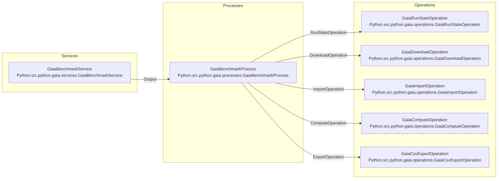

# Gaia DR3 Parallel IoP Benchmark

This project is an InterSystems IRIS Interoperability On Python, or IoP, application for the Gaia DR3 epoch photometry benchmark described in [GOAL.md](GOAL.md).

It processes the first 20 Gaia DR3 epoch photometry archives, computes BP/RP flux variation by `source_id`, and writes the qualifying results to `output/results.csv` with a header row.

## Goal

The benchmark asks for every astronomical object whose BP or RP flux changed by more than 100 percent over the observation period.

For each `source_id`, the application:

1. Reads only the first 20 Gaia DR3 epoch photometry files, from `EpochPhotometry_000000-003111.csv.gz` through `EpochPhotometry_020985-021233.csv.gz`.
2. Parses `bp_flux` and `rp_flux` array fields.
3. Ignores blanks, null-like values, `NaN`, infinities, and malformed values.
4. Computes BP min/max and RP min/max across valid values.
5. Computes percentage change as `((max_flux - min_flux) / min_flux) * 100`.
6. Keeps the larger BP/RP percentage change.
7. Outputs only rows where `percentage_change > 100`.

Output columns:

```text
source_id,bp_min_flux,bp_max_flux,rp_min_flux,rp_max_flux,percentage_change
```

The CSV starts with that header row, followed by one row per qualifying `source_id`.

## Quick Run

Requirements:

- Docker with Docker Compose
- Network access to the Gaia CDN

Run the benchmark:

```bash
./RunChallenge.sh
```

`RunChallenge.sh` rebuilds and recreates the IRIS container, starts the IoP production, waits for completion, and prints `output/results.csv` to stdout.

The generated files are:

- `output/downloads/*.csv.gz`: downloaded Gaia source files
- `output/results.csv`: final benchmark output
- `output/results.done`: success marker
- `output/results.err`: failure marker, if the production fails

## Local Development

Create and use a virtual environment if one is not already present:

```bash
python -m venv .venv
. .venv/bin/activate
pip install -r requirements.txt
```

Run tests:

```bash
.venv/bin/python -m pytest
```

Validate the IoP production without writing to IRIS:

```bash
.venv/bin/iop --migrate settings.py --dry-run
```

Run the full Docker workflow:

```bash
docker compose up --build
```

## Architecture

The application is an IoP production declared in [settings.py](settings.py) and [src/python/gaia/production.py](src/python/gaia/production.py).

Business roles:

- `GaiaBenchmarkService`: polling entrypoint. It starts one benchmark run when neither `results.done` nor `results.err` exists.
- `GaiaBenchmarkProcess`: orchestrates the workflow.
- `GaiaRunStateOperation`: prepares run state and writes success/failure markers.
- `GaiaDownloadOperation`: downloads or reuses one local gzip file per request.
- `GaiaImportOperation`: imports one gzip file per request and writes per-file source aggregates in DBAPI batches.
- `GaiaComputeOperation`: aggregates persisted per-file rows into final qualifying `PhotometryChange` rows.
- `GaiaCsvExportOperation`: exports final rows to `output/results.csv`.

IoP Mermaid graph generated from the production object:



## Workflow

1. `GaiaBenchmarkService` polls once per second.
2. It creates `output/results.lock` and sends a `GaiaBenchmarkRequest` to the process.
3. `GaiaBenchmarkProcess` calls `GaiaRunStateOperation` to clear prior persistent rows and output markers.
4. The process fans out 20 download requests to `GaiaDownloadOperation`.
5. Downloads are stored in `output/downloads/`. Existing readable gzip files are reused.
6. The process fans out 20 import requests to `GaiaImportOperation`.
7. Each import request parses one gzip file, computes per-row BP/RP min/max values, and inserts aggregate rows with `executemany`.
8. `GaiaComputeOperation` uses SQL to combine all per-file aggregates by `source_id`, calculate percentage change, and persist only results over 100 percent.
9. `GaiaCsvExportOperation` writes final rows ordered by `source_id` to `output/results.csv`.
10. `GaiaRunStateOperation` writes `output/results.done`.

If any step fails, the process asks `GaiaRunStateOperation` to write `output/results.err`, then re-raises the failure.

## Persistent Data

The application uses [iris-persistence](https://github.com/grongierisc/iris-persistence) for class-backed persistent tables:

- `GaiaDR3.SourceFluxAggregate`: per-run, per-file, per-source BP/RP min/max aggregates
- `GaiaDR3.PhotometryChange`: final per-source qualifying results

Persistent indexes:

| Table | Index | Properties | Purpose |
| --- | --- | --- | --- |
| `GaiaDR3.SourceFluxAggregate` | `SourceAggregateRunIdx` | `run_name` | Delete or scan one benchmark run during preparation and compute. |
| `GaiaDR3.SourceFluxAggregate` | `SourceAggregateSourceIdx` | `run_name,source_id` | Group and aggregate per-source rows for a run. |
| `GaiaDR3.PhotometryChange` | `PhotometryChangeRunIdx` | `run_name` | Delete or scan final results for one run. |
| `GaiaDR3.PhotometryChange` | `PhotometryChangeSourceIdx` | `run_name,source_id` | Read final results ordered by source for export and inspection. |

The application intentionally does not persist every raw observation value. The benchmark output only requires per-source min/max and percentage change, so persisting aggregate rows keeps IRIS storage smaller while preserving the data needed for final SQL analytics.

Downloaded files are persisted on disk under `output/downloads/`; the presence of a readable gzip file is the download handoff state.

## Compute SQL

The compute step uses two persistent tables:

- Source table: `GaiaDR3.SourceFluxAggregate`
- Change table: `GaiaDR3.PhotometryChange`

`SourceFluxAggregate` is the input to compute. Each row represents one imported source aggregate from one downloaded file:

```text
run_name,file_range,source_id,bp_min_flux,bp_max_flux,rp_min_flux,rp_max_flux
```

`PhotometryChange` is the materialized final result table. It stores only rows that satisfy the benchmark rule:

```text
run_name,source_id,bp_min_flux,bp_max_flux,rp_min_flux,rp_max_flux,percentage_change
```

`GaiaComputeOperation` inserts into `PhotometryChange` with one set-oriented SQL statement:

1. Delete prior final rows for the same `run_name`.
2. Read `SourceFluxAggregate` rows for that `run_name`.
3. Group by `source_id`.
4. Compute global min/max BP and RP flux values for each source.
5. Compute BP and RP percentage changes.
6. Keep the bigger BP/RP change as `percentage_change`.
7. Insert only rows where `percentage_change > 100`.

The core grouping is:

```sql
SELECT
  source_id,
  MIN(bp_min_flux) AS bp_min_flux,
  MAX(bp_max_flux) AS bp_max_flux,
  MIN(rp_min_flux) AS rp_min_flux,
  MAX(rp_max_flux) AS rp_max_flux
FROM GaiaDR3.SourceFluxAggregate
WHERE run_name = ?
GROUP BY source_id
```

Then the compute query applies the benchmark formula:

```sql
CASE
  WHEN bp_min_flux IS NULL OR bp_min_flux = 0
    THEN NULL
  ELSE ((bp_max_flux - bp_min_flux) / bp_min_flux) * 100
END AS bp_change
```

The same logic is applied to RP. The final `percentage_change` is the larger non-null value between `bp_change` and `rp_change`.

Example with one source appearing in multiple files:

| file_range | source_id | bp_min_flux | bp_max_flux | rp_min_flux | rp_max_flux |
| --- | ---: | ---: | ---: | ---: | ---: |
| `000000-003111` | `101` | `10` | `20` | `5` | `8` |
| `003112-005263` | `101` | `7` | `30` | `4` | `9` |

After SQL grouping:

| source_id | bp_min_flux | bp_max_flux | rp_min_flux | rp_max_flux |
| ---: | ---: | ---: | ---: | ---: |
| `101` | `7` | `30` | `4` | `9` |

Percentage changes:

```text
BP = ((30 - 7) / 7) * 100 = 328.5714
RP = ((9 - 4) / 4) * 100 = 125
percentage_change = 328.5714
```

That row is inserted into `PhotometryChange` because `328.5714 > 100`.

Example where a zero minimum is ignored for one band:

| source_id | bp_min_flux | bp_max_flux | rp_min_flux | rp_max_flux |
| ---: | ---: | ---: | ---: | ---: |
| `202` | `0` | `10` | `4` | `12` |

BP change is `NULL` because the minimum is zero. RP change is `200`, so the final `percentage_change` is `200`.

On the current benchmark dataset, the first 20 Gaia files produced `75064` `SourceFluxAggregate` rows and `75064` distinct `source_id` values, so there were no duplicate `source_id` values across files after import. The SQL still groups by `source_id` because it is the correct benchmark operation and keeps the production robust if a future dataset contains the same source in multiple files.

SQL is a good fit here because the data is already in IRIS:

- It avoids pulling all aggregate rows back into Python.
- It lets IRIS perform grouping, min/max, filtering, and insertion as one set operation.
- It uses the `run_name,source_id` indexes to target one run and organize per-source aggregation.
- It materializes final results in `PhotometryChange`, making export and inspection simple.

## Configuration

Runtime configuration is in [settings.py](settings.py) and is passed to every IoP component as production settings.

Environment overrides:

| Variable | Default | Purpose |
| --- | --- | --- |
| `GAIA_OUTPUT_DIR` | `/irisdev/app/output` | Output directory inside the container |
| `GAIA_REQUEST_TIMEOUT_SECONDS` | `1800` | Sync request timeout for long-running workflow calls |
| `GAIA_HTTP_TIMEOUT_SECONDS` | `120` | Per-download HTTP timeout |
| `GAIA_DB_BATCH_SIZE` | `10000` | DBAPI aggregate insert batch size |
| `GAIA_DOWNLOAD_CHUNK_SIZE` | `1048576` | Download read chunk size |
| `GAIA_ACTOR_POOL` | `8` | Production actor pool size |
| `GAIA_DOWNLOAD_POOL` | `4` | Download operation pool size |
| `GAIA_IMPORT_POOL` | `4` | Import operation pool size |

The 20 benchmark files are configured as compact numeric file boundaries in `FIRST_20_FILE_BOUNDARIES`; components expand those boundaries into Gaia archive file ranges at runtime.

## How It Meets GOAL.md

- Fully functional: `RunChallenge.sh` starts IRIS, runs the production, waits for completion, and prints the CSV result file.
- Scalable ingestion: downloads and imports are fan-out operations with configurable pool sizes.
- InterSystems-first implementation: orchestration runs through an IRIS IoP production; aggregate and final result data are stored in IRIS persistent tables.
- Correct dataset: `settings.py` targets exactly the first 20 Gaia DR3 epoch photometry archives required by the benchmark.
- Correct output: final CSV contains `source_id,bp_min_flux,bp_max_flux,rp_min_flux,rp_max_flux,percentage_change` as the header, followed by one object per row.
- Correct filtering: SQL persists only rows where the computed maximum BP/RP percentage change is greater than 100.
- Automated execution: `RunChallenge.sh` is suitable for CI because it requires no manual input and prints only the CSV result file on success.

## Verification

Fast local checks:

```bash
.venv/bin/python -m pytest
.venv/bin/python -m compileall -q src tests settings.py
.venv/bin/iop --migrate settings.py --dry-run
```

Full benchmark check:

```bash
./RunChallenge.sh > /tmp/gaia-results.csv
wc -l /tmp/gaia-results.csv
```

On the current implementation, the full run produces `57099` data rows for the benchmark dataset, plus the header row.
